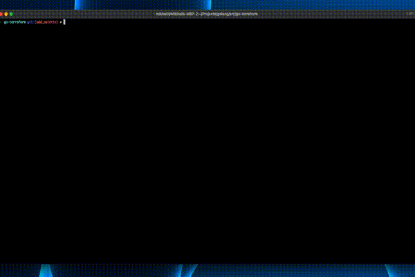

# lip-palette

> **_IMPORTANT:_** This project is a work in progress.

Terminal UI component that allows you creating a palette (matrix) of items. Based on [Lipgloss](https://github.com/charmbracelet/lipgloss)

# Usage

Get the lip-palette module

```bash
go get github.com/misha-slyusarev/lip-palette@v0.1.0
```

Then in your code use it together with [Bubbletea](https://github.com/charmbracelet/bubbletea)
```go
package ui

import (
  tea "github.com/charmbracelet/bubbletea"
  palette "github.com/misha-slyusarev/lip-palette"
)

type mainPageModel struct {
  plt palette.Model
}

func (m mainPageModel) Init() tea.Cmd {
  return tea.EnterAltScreen
}

...
```

# Example

This project is in experimentation mode right now. Here is an example of me using the library in another project to display 15 objects on the screen and navigate through them.



